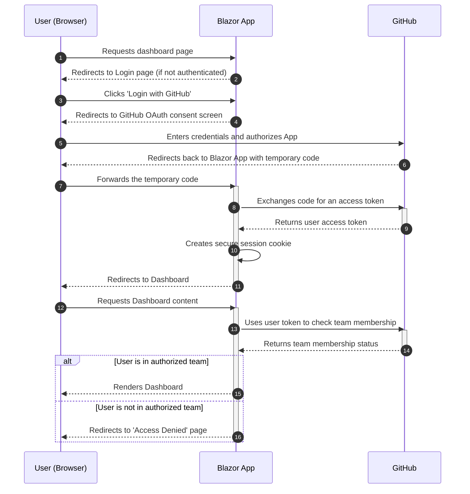
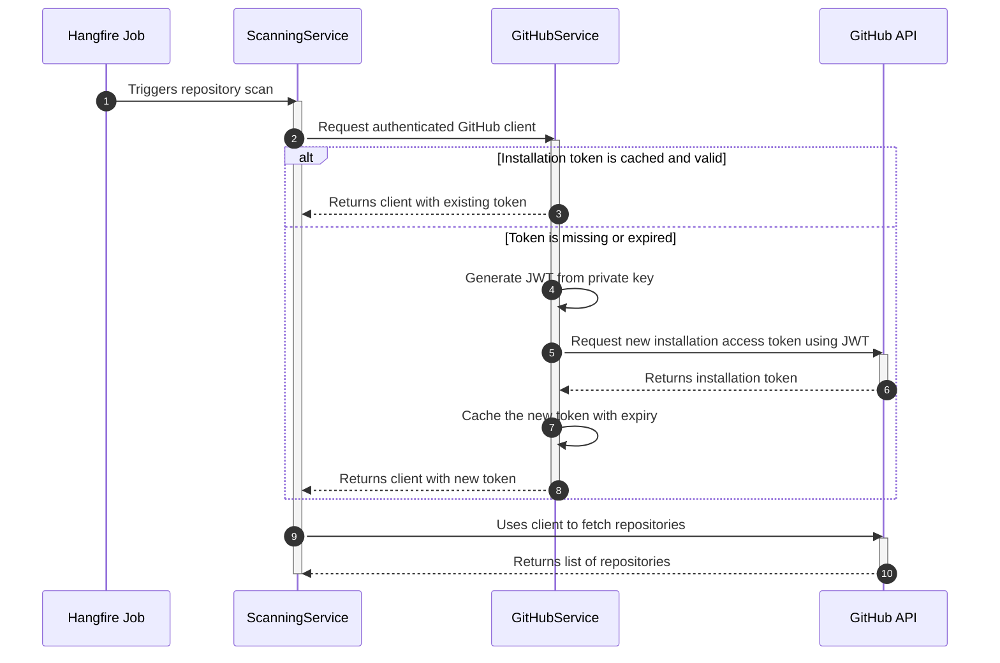

# Authentication Specification: 10xGitHub Policy Enforcer

## 1. Introduction

This document defines the authentication and authorization architecture for the 10x GitHub Policy Enforcer application. To meet the project's requirements for both interactive user sessions and unattended background processing, a dual-authentication strategy will be implemented. This strategy leverages two distinct GitHub features:

1.  **GitHub OAuth App:** For authenticating users into the web dashboard.
2.  **GitHub App:** For authenticating the backend application to perform automated scans and actions against the GitHub API.

This separation ensures a secure, robust, and scalable design that adheres to the principle of least privilege.

---

## 2. Authentication Flows Overview

The application employs a dual-authentication strategy to serve two different purposes:

1.  **User Authentication (GitHub OAuth App):** This flow manages user sign-in to the Blazor web dashboard. It verifies a user's identity and authorizes them based on their membership in a pre-configured GitHub Team.
2.  **Application Authentication (GitHub App):** This flow is used by backend services for unattended, automated interactions with the GitHub API, such as scanning repositories or creating issues, independent of any logged-in user.

### 2.1. Actors and Interactions

*   **User Authentication Flow:**
    *   **User (Browser):** The end-user interacting with the web UI.
    *   **Blazor App:** The server-side application that handles the OAuth 2.0 flow, creates a secure session, and performs authorization checks.
    *   **GitHub:** The identity provider that authenticates the user and provides the access token.

*   **Application Authentication Flow:**
    *   **Hangfire Job:** A background job scheduler that triggers automated tasks like daily scans.
    *   **ScanningService:** The service that orchestrates the repository scanning logic.
    *   **GitHubService:** A singleton service responsible for managing the application's authentication credentials (JWT and installation access tokens).
    *   **GitHub API:** The remote GitHub API that the application communicates with.

### 2.2. Token Management

*   **User OAuth Token:** A user-specific access token obtained via the OAuth flow. It is used to verify the user's GitHub Team membership for authorization. The user's session is maintained by a persistent, secure cookie managed by the Blazor App.
*   **GitHub App Installation Token:** A short-lived (1-hour) token that grants the application permissions to access an organization's repositories. The `GitHubService` generates a long-lived JWT from a private key, exchanges it for this installation token, and caches it in memory until it's close to expiring, at which point it is refreshed.

---

## 3. User Authentication (GitHub OAuth App)

This flow handles user sign-in to the Blazor web dashboard. It is responsible for verifying a user's identity and authorizing them based on their organization roles.

*   **Purpose:** To securely authenticate users for the web UI and verify their membership in the authorized GitHub Team, as specified in `US-001`, `US-002`, and `US-005`.

### 3.1. User Authentication Flow Diagram

This diagram illustrates how a user logs into the web dashboard.



### 3.2. Implementation Details

*   **File:** `10xGitHubPolicies.App/Program.cs`
*   **Responsibility:** This file will contain the service configuration for authentication. We will use the `AddAuthentication` and `AddGitHub` extension methods to configure the OAuth 2.0 flow. This setup will handle the redirects to GitHub, the callback, and the creation of a secure session cookie for the authenticated user.

    ```csharp
    // Example for Program.cs
    builder.Services.AddAuthentication(options =>
    {
        options.DefaultAuthenticateScheme = CookieAuthenticationDefaults.AuthenticationScheme;
        options.DefaultSignInScheme = CookieAuthenticationDefaults.AuthenticationScheme;
        options.DefaultChallengeScheme = "GitHub";
    })
    .AddCookie()
    .AddGitHub(options =>
    {
        options.ClientId = builder.Configuration["GitHub:ClientId"];
        options.ClientSecret = builder.Configuration["GitHub:ClientSecret"];
        options.Scope.Add("read:org");
    });
    ```
*   **Authorization Logic:** After a user signs in, their access to the main dashboard page will be protected by the `[Authorize]` attribute. On that page's logic (`OnInitializedAsync`), we will use the user's OAuth access token (retrieved from the `HttpContext`) to initialize an `Octokit.net` client. This client will then be used to call the GitHub API and verify the user's membership in the team specified in `config.yaml`. If they are not a member, they will be redirected to an "Access Denied" page.

### 3.3. Required OAuth Scopes

*   `read:org`: Grants read-only access to organization membership, which is essential for verifying a user's team membership for authorization.

---

## 4. Application Authentication (GitHub App)

This flow is used by the backend services to interact with the GitHub API independently of any logged-in user.

*   **Purpose:** To enable unattended, organization-wide repository scanning and administrative actions as required by `US-009` (Scheduled Scans), `US-010` (Issue Creation), and `US-011` (Repository Archiving).

### 4.1. Application Authentication Flow Diagram

This diagram shows how the backend service authenticates to perform automated tasks.



### 4.2. Implementation Details

*   **Service:** A new `GitHubService.cs` (and corresponding `IGitHubService` interface) will be created.
*   **Responsibility:** This service will be a singleton that encapsulates all backend communication with the GitHub API.
    *   It will be responsible for generating the GitHub App's JWT using the private key.
    *   It will use the JWT to request and cache a short-lived installation access token. The token should be cached in memory with an expiry slightly shorter than its actual lifetime (e.g., 55 minutes for a 60-minute token) to ensure a new one is fetched before it expires.
    *   It will expose methods like `GetRepositoriesAsync()`, `CreateIssueAsync()`, `ArchiveRepositoryAsync()`, etc. Internally, these methods will use an `Octokit.net` `GitHubClient` instance that is authenticated with the installation access token.
*   **Consuming Service:** A new `ScanningService.cs` will be created.
    *   **Responsibility:** This service will be triggered by Hangfire jobs (both scheduled and on-demand). It will depend on `IGitHubService` via dependency injection. It will orchestrate the scan: fetch all repositories from the `GitHubService`, check each one for policy compliance, and call the appropriate `GitHubService` methods to perform actions like creating issues or archiving repositories.

### 4.3. Required GitHub App Permissions

#### Repository Permissions:

*   **Administration:** `Read & write` (To read settings and archive repositories)
*   **Contents:** `Read-only` (To check for file presence)
*   **Issues:** `Read & write` (To create and check for duplicate issues)
*   **Metadata:** `Read-only` (To list repositories)
