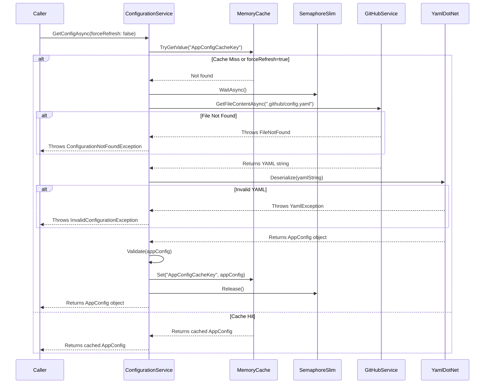

# Implementation Plan: IConfigurationService

## 1. Service Overview

The `IConfigurationService` is a core infrastructural component responsible for managing the application's runtime configuration. Its primary duty is to fetch, deserialize, and cache the `config.yaml` file from the organization's `.github` repository.

By centralizing configuration access, this service ensures that all other parts of the application work with a consistent, strongly-typed configuration object (`AppConfig`). It incorporates an in-memory caching layer to minimize GitHub API calls, enhancing performance and avoiding rate-limiting issues.

---

## 2. Input Details

### Method Signature
```csharp
Task<AppConfig> GetConfigAsync(bool forceRefresh = false);
```

### Parameters
-   `forceRefresh` (boolean): When `true`, the service bypasses any cached configuration and fetches the latest version from GitHub. Defaults to `false`.

### Dependencies (Injected via Constructor)
-   `IGitHubService`: Used to perform the underlying GitHub API call to retrieve the `config.yaml` file content.
-   `IMemoryCache`: The standard ASP.NET Core in-memory cache used to store the deserialized `AppConfig` object.
-   `IOptions<GitHubAppOptions>`: Provides access to application settings, specifically the `OrganizationName` required to locate the `.github` repository.
-   `ILogger<ConfigurationService>`: For structured logging of service operations and errors.

---

## 3. Output Details

### Return Type
-   `Task<AppConfig>`: An asynchronous operation that returns a strongly-typed `AppConfig` object.

### `AppConfig` Model Definition
The following C# models will be created to represent the structure of `config.yaml`. These will reside in `10xGitHubPolicies.App/Models/Configuration/`.

```csharp
// 10xGitHubPolicies.App/Models/Configuration/AppConfig.cs
using YamlDotNet.Serialization;

public class AppConfig
{
    [YamlMember(Alias = "access_control")]
    public AccessControlConfig AccessControl { get; set; }

    public List<PolicyConfig> Policies { get; set; } = new();
}

// 10xGitHubPolicies.App/Models/Configuration/AccessControlConfig.cs
using YamlDotNet.Serialization;

public class AccessControlConfig
{
    [YamlMember(Alias = "authorized_team")]
    public string AuthorizedTeam { get; set; }
}

// 10xGitHubPolicies.App/Models/Configuration/PolicyConfig.cs
public class PolicyConfig
{
    public string Type { get; set; }
    public string Action { get; set; }
}
```

### Custom Exceptions
To enable specific error handling by consumers, the service will throw the following custom exceptions, which will be defined in a new `10xGitHubPolicies.App/Exceptions/` directory.

-   `ConfigurationNotFoundException`: Thrown when the `.github/config.yaml` file does not exist in the organization repository. This signals to the UI that the onboarding flow should be displayed (US-003).
-   `InvalidConfigurationException`: Thrown if the `config.yaml` file is malformed (invalid YAML) or if essential values are missing after deserialization.

---

## 4. Data Flow

The `GetConfigAsync` method will follow this sequence:

1.  A static cache key is defined within the service (e.g., `"AppConfigCacheKey"`).
2.  If `forceRefresh` is `false`, the method attempts to retrieve the `AppConfig` object from `IMemoryCache` using the key. If found, the cached object is returned immediately.
3.  If the cache is empty or `forceRefresh` is `true`, the service proceeds to fetch the configuration.
4.  A `SemaphoreSlim` is used to ensure that only one thread can execute the fetch-and-deserialize logic at a time, preventing race conditions under high load.
5.  The service retrieves the organization name from `IOptions<GitHubAppOptions>`.
6.  It calls a method on `IGitHubService` (e.g., `GetFileContentAsync`) to get the raw string content of the `.github/config.yaml` file.
7.  **Error Path**: If `IGitHubService` indicates the file was not found, it throws a `ConfigurationNotFoundException`.
8.  The raw YAML string is deserialized into the `AppConfig` object graph using `YamlDotNet`.
9.  **Error Path**: If deserialization fails, a `YamlException` is caught and wrapped in an `InvalidConfigurationException`.
10. The deserialized `AppConfig` object is validated to ensure required properties (e.g., `AccessControl.AuthorizedTeam`) are not null or empty.
11. **Error Path**: If validation fails, an `InvalidConfigurationException` is thrown.
12. The validated `AppConfig` object is stored in `IMemoryCache` with a defined sliding expiration (e.g., 15 minutes).
13. The new `AppConfig` object is returned.

### Sequence Diagram


---

## 5. Security Considerations

-   **Least Privilege**: The service relies on `IGitHubService`, which uses a GitHub App installation token. The permissions for this token should be scoped to the minimum required (read-only access to repository contents).
-   **Data Exposure**: The `config.yaml` file may contain information like team slugs. The service should not log the entire configuration object at `Information` level or higher to prevent accidental exposure in production logs.
-   **Singleton Lifetime**: The service will be registered as a singleton to maintain the cache and semaphore instance across the application. The implementation must be thread-safe, which is achieved via `SemaphoreSlim`.

---

## 6. Error Handling

-   **File Not Found**: The service will catch the specific exception from `IGitHubService` indicating a 404 error and re-throw it as a `ConfigurationNotFoundException` to provide clear context to the caller.
-   **Invalid Content**: `YamlDotNet` exceptions during parsing will be caught and wrapped in a new `InvalidConfigurationException` that includes the original parsing error as an inner exception for debugging purposes.
-   **Missing Values**: Post-deserialization checks will be performed. If `AppConfig.AccessControl.AuthorizedTeam` is null or whitespace, an `InvalidConfigurationException` with a clear validation message will be thrown.

---

## 7. Performance

-   **Caching**: The primary performance mechanism is the use of `IMemoryCache`. A sliding expiration of 15 minutes is recommended as a starting point. This ensures that the application is reasonably up-to-date while protecting the GitHub API from excessive calls.
-   **Asynchrony**: All I/O operations (file fetching) are fully asynchronous (`async/await`) to ensure the service is non-blocking and scalable.
-   **Concurrency**: The use of `SemaphoreSlim(1, 1)` prevents "cache stampede" scenarios where multiple concurrent requests attempt to refresh the cache simultaneously.

---

## 8. Implementation Steps

1.  **Add Dependencies**:
    -   Add the `YamlDotNet` NuGet package to the `10xGitHubPolicies.App.csproj` project.
        ```shell
        dotnet add package YamlDotNet
        ```

2.  **Define Models**:
    -   Create a new folder: `10xGitHubPolicies.App/Models/Configuration`.
    -   Create the `AppConfig.cs`, `AccessControlConfig.cs`, and `PolicyConfig.cs` files inside the new folder with the code from Section 3.

3.  **Define Custom Exceptions**:
    -   Create a new folder: `10xGitHubPolicies.App/Exceptions`.
    -   Create `ConfigurationNotFoundException.cs` and `InvalidConfigurationException.cs` inheriting from `Exception`.

4.  **Define Interface**:
    -   In `10xGitHubPolicies.App/Services/`, create `IConfigurationService.cs` with the `GetConfigAsync` method definition.

5.  **Implement Service**:
    -   In `10xGitHubPolicies.App/Services/`, create `ConfigurationService.cs`.
    -   Implement the `IConfigurationService` interface.
    -   Inject the required dependencies (`IGitHubService`, `IMemoryCache`, etc.).
    -   Implement the data flow logic described in Section 4, including caching, semaphore, fetching, deserialization, and validation.

6.  **Register Services (DI)**:
    -   In `Program.cs`, register the service and `IMemoryCache`.
        ```csharp
        builder.Services.AddMemoryCache();
        builder.Services.AddSingleton<IConfigurationService, ConfigurationService>();
        ```
